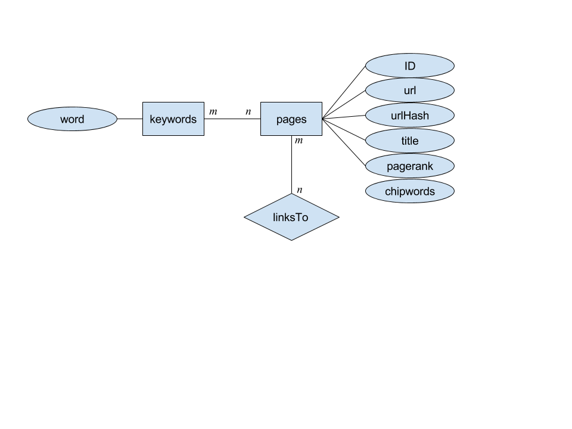

# Final Summary

## Project description and goals

The goal of this project was to create a simple search engine for pages on the
web. 

The project was to consist of 3 components:

1. A crawler written in python. This is program which downloads a webpage, selects some information
   from that page to store in the database, and then downloads more webpages based
   on the links found in the current webpage.
2. A web client written in Angular 4 which would allow a human to type in queries
   and view a list of relevant pages.
3. A web server written in python to accept queries from the web client and
   generate results based on the content in the DB.

## Database contents

Our database is really quite simple. The magic is all in the fact that we index
(B-Tree) the `word` column in the `keywords` table, and then just joint with
`page` ordering by `pagerank`.

A sketch of what is in our database:

**This diagram is for the axxelerate2 database. There is also a database called
axxerlate, but that did not have our final design, and is not the one that works
with our final code.**

## State of project

In this section, we describe what were and weren't able to accomplish.

It took us a while to decide what page our crawler should start on. We
eventually settled on restricting the crawler to collecting information from the
English Wikipedia site and pointed the crawler at that site's home page to get
it going. 

We were able to populate the database at a pretty good clip and would have been
able to build a really big database, but we had trouble with our connection to the
MariaDB database dying and never properly handled that scenario and only
collected data for a little over 5000 pages, which severely limits the relevancy
of our results. 

Adding indexes to the database after we filled it with data only took a short
while and increased the speed of our queries tremendously (e.g. going from 7
seconds to 0.01, and going from over 30 seconds to 0.01).

After populating the DB, we implemented PageRank and computed a PageRank for each
page. This is the single mechanism we use for ranking results, but it isn't
particularly good for our scenario, since PageRank is better for establishing
the credibility/importance of pages, but all the content pages on Wikipedia are
equally important. It is just a question of which page is _relevant_ to the
given keyword and PageRank doesn't help with that.

The giving each URL a rank does allow us to sort the results and thus implement
semi-decent pagination. The pagination allows the client to avoid downloading
the results it doesn't care about, but if the client ends up paging through the
whole result list anyway, this will incur 2x the read cost on the DB that simply
dumping all the results would have incurred.

## Potential for future work

Some room for improvement was mentioned above, but there is more, including but
not limited to:

- Allow multiple keywords (we currently only allow one)
- Improve filtering/transformation of the words that we put in the DB
- Add filtering/transformation of words being passed in as a query
- Use a different ranking algorithm that shows actual relevant data
- Have _more_ pages indexed in the DB
- Include some sort of summary of the contents of the page (currently we have
  snippets of words from the page, but it isn't clear why those are relevant)
- Figure out how to restart crawls part way through (we currently truncate the
  tables before starting the crawler)
- Fix the crawler connection to the DB (either restart on failure or create a
  new connection for every page)
- Add a _lot_ of documentation. We've not clearly documented how to run the web
  client, how to run the crawler, how to generate the pagerank, nor how to fetch
  the chipwords.
